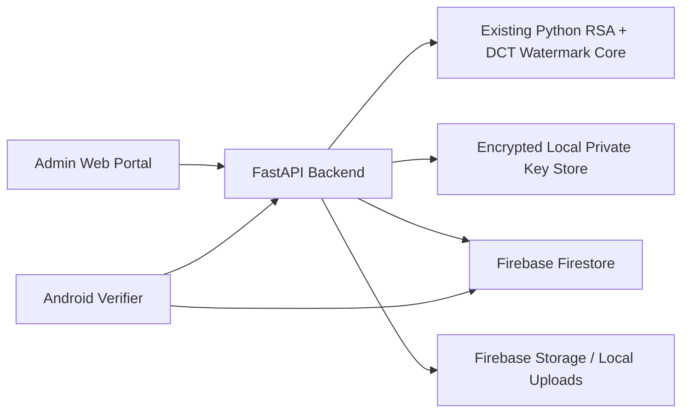

# Digital Trust Shield Product Setup

Digital Trust Shield now has three layers:

1. `backend/` FastAPI + Firebase integration.
2. `admin-portal/` React authority/signing console.
3. `android-verifier/` Kotlin verification app.

The existing Python watermarking/signature files remain the cryptographic core.

## Architecture



## Firebase Setup

1. Create a Firebase project.
2. Enable Firestore and create the default database.
3. Enable Firebase Storage only if billing is available. Otherwise keep local storage mode enabled.
4. Download Firebase Admin SDK service account JSON.
5. Save it as `backend/secrets/serviceAccountKey.json`.
6. Copy `backend/.env.example` to `backend/.env`.
7. Generate a master encryption key:

```powershell
cd backend
python generate_master_key.py
```

8. Put the key into `MASTER_KEY`.
9. For no-billing mode, keep `USE_LOCAL_STORAGE=true`, `LOCAL_UPLOAD_DIR=uploads`, `FIREBASE_STORAGE_BUCKET=`, and `STORAGE_MAKE_PUBLIC=false`.
10. If you later enable Firebase Storage, set `USE_LOCAL_STORAGE=false` and set `FIREBASE_STORAGE_BUCKET=your-project-id.appspot.com`.

Private keys are encrypted locally under `backend/secure_private_keys/` and are never written to Firebase.

## Backend

```powershell
cd backend
pip install -r requirements.txt
run_server.cmd
```

API URL:

```text
http://127.0.0.1:8000
```

Health check:

```text
GET /api/health
```

## Admin Portal

```powershell
cd admin-portal
copy .env.example .env
npm install
npm run dev
```

Open:

```text
http://localhost:5173
```

Default demo login is controlled by backend `.env`:

```text
ADMIN_USERNAME=admin
ADMIN_PASSWORD=admin123
```

## Android Verifier

1. Open `android-verifier/` in Android Studio.
2. Run the backend.
3. For emulator, keep `API_BASE_URL` as `http://10.0.2.2:8000/`.
4. For a real phone, change it in `android-verifier/app/build.gradle.kts` to your laptop IP.
5. Build and run.

## Hackathon Demo Flow

1. Open the Admin Portal.
2. Create authority: `Bengaluru Public Notice Authority`.
3. Generate RSA key pair.
4. Show public key in Firebase `public_keys`.
5. Upload a government poster or PDF.
6. Click Sign Document.
7. Show signed document URL from Firebase Storage.
8. Download/share the signed output.
9. Open Android app.
10. Select signed image.
11. Select authority/public key.
12. Tap Verify.
13. Show Authentic.
14. Modify the image text/date/amount.
15. Verify modified image.
16. Show Fake / Tampered.

With local storage mode, step 7 becomes: show the signed document URL from `http://127.0.0.1:8000/uploads/signed_documents/...`.

## Firebase Collections

- `authorities`
- `public_keys`
- `signed_documents`
- `verification_logs`
- `audit_logs`

## Security Notes

- Never commit `backend/.env`.
- Never commit `backend/secrets/`.
- Never commit `backend/secure_private_keys/`.
- Backend only exposes public keys and signed metadata.
- Android app never receives a private key.
- For production, replace local Fernet private-key storage with Google Cloud Secret Manager, KMS, HSM, or a signing service.
