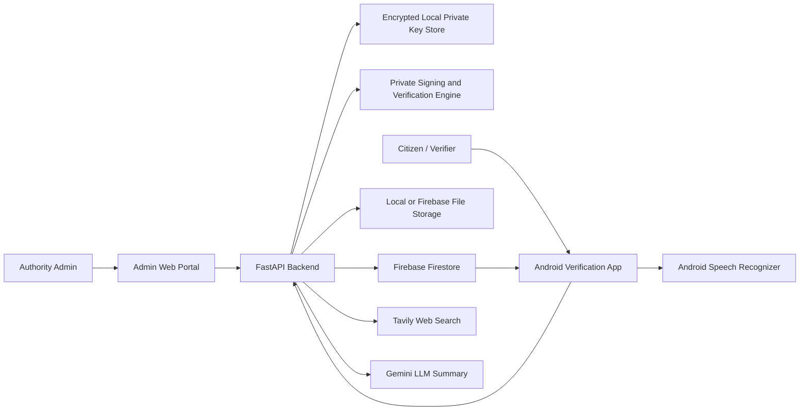
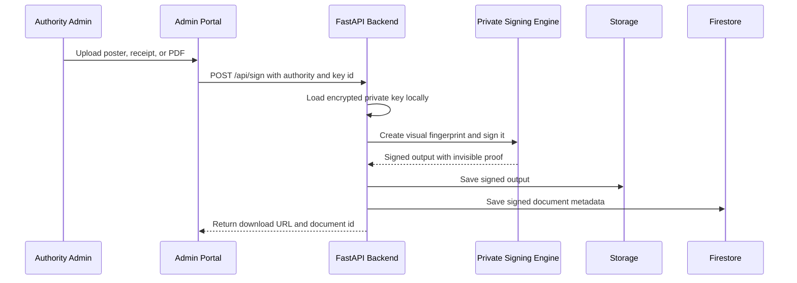
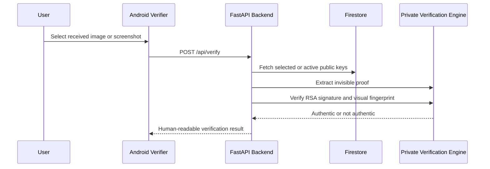
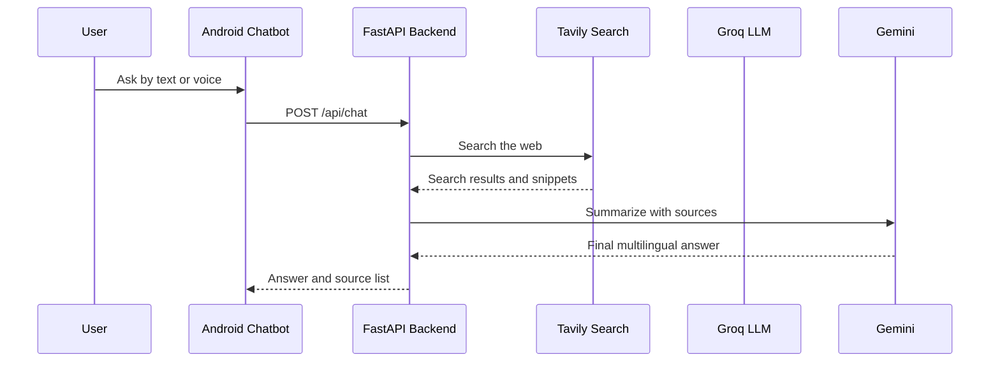

# Digital Trust Shield

Digital Trust Shield is a hackathon prototype for verifying whether government posters, payment receipts, notices, PDFs, and shared screenshots are authentic or tampered.

The public repository intentionally contains product documentation, architecture, demo flow, and integration notes only. The private cryptographic signing and watermarking implementation is not published.

## Why This Exists

Important public and financial information is often shared through low-trust channels such as WhatsApp, screenshots, forwarded images, and PDFs. These files can be edited, recompressed, cropped, or forged, and ordinary users have no simple way to know whether a poster or receipt is genuine.

Digital Trust Shield solves this by attaching an invisible cryptographic proof to the visual document itself.

## Core Idea

1. A trusted authority signs a visual fingerprint of a poster, receipt, PDF page, or notice.
2. The proof is embedded invisibly into the image pixels using a resilient watermarking strategy.
3. A verifier app extracts the proof and validates it against the authority public key.
4. The user sees a simple result: authentic, fake/tampered, watermark not found, or verification failed.

## Current Product Scope

- Admin signing portal for authorities.
- FastAPI backend for signing, verification, metadata, audit logs, and chatbot services.
- Android verifier app for public users.
- Firebase Firestore for authorities, public keys, signed-document metadata, logs, and audit records.
- Local file storage fallback for signed outputs when Firebase Storage is unavailable.
- AI chatbot assistant using Tavily web search and Gemini summarization.
- Voice input and multilingual chatbot support for English, Kannada, and Hindi.

## Architecture



## Signing Flow



## Verification Flow



## AI Chatbot Flow



## Security Model

- Private keys are never stored in Firebase.
- Private keys are encrypted and stored only on the backend machine.
- Android app receives only public keys and verification responses.
- Firestore stores authority metadata, public keys, signed-document metadata, verification logs, and audit logs.
- The public repository does not expose the private watermarking, signing, extraction, or screenshot-recovery implementation.

## Repository Publication Policy

This GitHub version is designed for public demonstration. It intentionally excludes:

- RSA private keys and key backups.
- Firebase service account credentials.
- Full signing and watermarking source code.
- Backend security-sensitive implementation files.
- Android and web app source code.
- Generated screenshots, payment images, QA artifacts, videos, and runtime logs.

See [docs/PUBLICATION_POLICY.md](docs/PUBLICATION_POLICY.md) for details.

## Tech Stack

| Layer | Technology |
| --- | --- |
| Backend | Python, FastAPI |
| Signing core | RSA signatures, perceptual fingerprints, DCT watermarking |
| Admin portal | React, Vite, TypeScript |
| Mobile app | Android Kotlin, Jetpack Compose |
| Database | Firebase Firestore |
| Storage | Local storage fallback, Firebase Storage optional |
| AI assistant | Tavily Search API, Groq Chat Completions |
| Voice | Android Speech Recognizer |

## Demo Script

1. Admin creates an authority.
2. Admin generates a key pair.
3. Backend stores the private key encrypted locally.
4. Backend stores the public key in Firestore.
5. Admin uploads and signs a poster or receipt.
6. Signed output is shared through WhatsApp or downloaded to a phone.
7. User opens the Android verifier app.
8. User selects the received image or screenshot.
9. App calls the backend verification API.
10. App displays authentic or fake/tampered.
11. User opens the chatbot tab and asks questions by text or voice.

## Environment Variables

The private implementation uses environment variables similar to:

```env
FIREBASE_CREDENTIALS=secrets/serviceAccountKey.json
USE_LOCAL_STORAGE=true
LOCAL_UPLOAD_DIR=uploads
FIREBASE_STORAGE_BUCKET=
MASTER_KEY=your_fernet_master_key
ADMIN_USERNAME=admin
ADMIN_PASSWORD=admin123
TAVILY_API_KEY=your_tavily_key
GEMINI_API_KEY=your_gemini_key
GEMINI_MODEL=your_gemini_model
```

Do not commit real `.env` files or service account credentials.

## Public Repository Note

This repository is a public showcase version. The complete implementation is retained privately by the team for demo, evaluation, and further development.

## Team

Team HAHAHA

Project repository target:

```text
https://github.com/Hiteshacu/Digital_Trust_Shield-Team-HAHAHA...-.git
```
