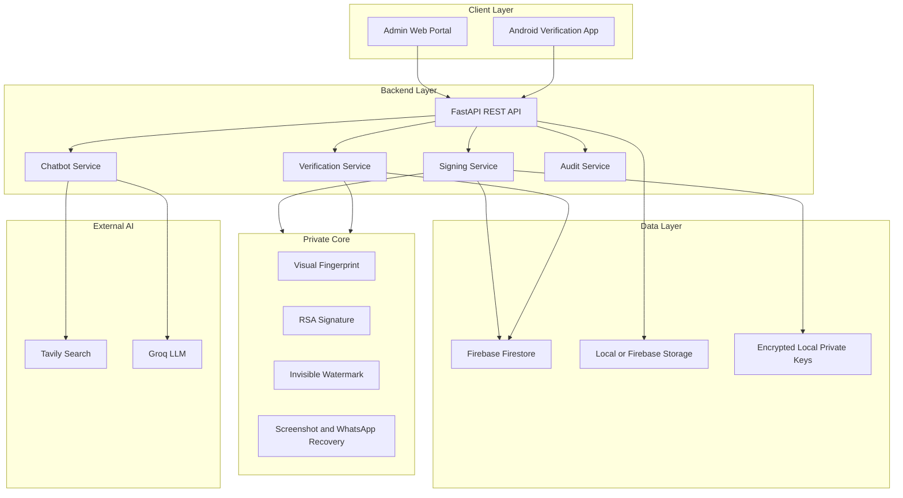

# Architecture

Digital Trust Shield is organized around one security boundary: private signing operations happen only on the backend, while verification clients receive public keys and human-readable results.

## Components

## Firestore Collections

| Collection | Purpose |
| --- | --- |
| `authorities` | Stores authority name, department, email, and status |
| `public_keys` | Stores public RSA keys and metadata |
| `signed_documents` | Stores signed document metadata and storage URL/path |
| `verification_logs` | Stores app verification results |
| `audit_logs` | Stores signing/key/audit events |

## Verification Result States

| Result | Meaning |
| --- | --- |
| `AUTHENTIC` | Hidden proof exists, signature is valid, and visual fingerprint matches |
| `WATERMARK_NOT_FOUND` | No Digital Trust Shield proof was found |
| `SIGNATURE_INVALID` | Proof exists but public key validation failed |
| `TAMPERED` | Proof exists but visual content changed |
| `ERROR` | Unexpected processing failure |

## Deployment Notes

- Backend should run on a trusted server or authority machine.
- Private keys must remain encrypted and local to the backend.
- Android app should call the backend over a reachable LAN or HTTPS URL.
- Firebase Storage is optional because local storage fallback is supported.
- Tavily and Groq API keys must stay in backend `.env`, never in the Android APK.
